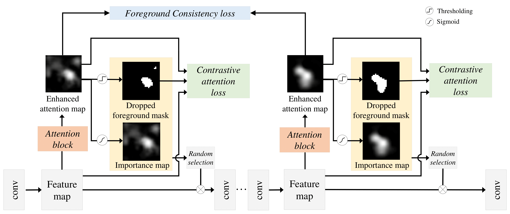

### (ACCV2020) In-sample Contrastive Learning and Consistent Attention for Weakly Supervised Object Localization

### Overview of InCA

### Paper
* Minsong Ki, Youngjung Uh, Wonyoung Lee, Hyeran Byun (Yonsei University)
* Paper: [https://arxiv.org/abs/2009.12063](https://arxiv.org/abs/2009.12063 "arXiv link")
